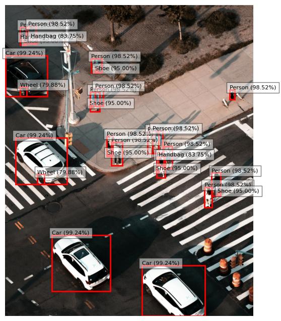

# Image Labels Generator with AWS Rekognition

This project leverages Amazon Rekognition to extract and generate descriptive labels for images stored in an S3 bucket.

## Introduction

This project utilizes Amazon Rekognition, a powerful AWS image analysis service, to automatically extract and generate descriptive labels for images stored in an Amazon S3 bucket.

By utilizing advanced machine learning algorithms, Amazon Rekognition can detect objects, scenes, and activities within our images, enabling efficient image categorization and search capabilities. Ideal for managing extensive image libraries, this project facilitates seamless integration with your AWS infrastructure, ensuring scalability and robustness.


## Steps to Doing the Project 🪜

This section provides a step-by-step guide on using the project. It involves the use of Simple Storage Service (S3) for storing the images, Amazon Rekognition to process the images, and Identity and Access Management (IAM) for authentication & authorization.

The steps involved include:

1. **Create an S3 Bucket:**

   The S3 bucket is used to store images that are going to be processed. To create an S3 bucket, log in to your AWS Management Console, navigate to S3, and click on "Create Bucket". Follow the prompts to set up your bucket with the desired settings.

2. **Uploading the Image in an S3 Bucket**

   Once the bucket is created, you can upload images by clicking on the bucket name, then clicking "Upload". Choose your image files and upload them to the bucket.

3. **Installing and Configuring AWS CLI**

   Install the AWS CLI by following the instructions on the AWS CLI official documentation. After installation, configure it by running `aws configure` and providing your AWS access key, secret key, region, and output format.

4. **Creating an IAM Role and Attaching Custom Access Policy**

   Create an IAM role for Rekognition to assume in the IAM console and configure a custom IAM policy using JSON or the visual setting option. Although I was tempted to grant S3 full access, creating a custom inline policy is more secure as it aligns with the principle of least privilege.

5. **Writing a Python Script to Programmatically Initiate Amazon Rekognition and Get Output**

   Using the Amazon SDK (boto3), programmatically initiate AWS Rekognition to extract images from S3, process them, and provide output and metadata. Ensure that the credentials are not hardcoded; instead, they should be exported to the environment variables using the AWS CLI.

   ```python
   import boto3
   import json
   from PIL import Image
   import io
   from dotenv import load_dotenv

   # Load environment variables from a .env file
   load_dotenv()

   # Initialize AWS clients
   region_name = "us-east-1"
   rekognition_client = boto3.client('rekognition', region_name=region_name)
   s3_client = boto3.client('s3', region_name=region_name)

## How It Works ⚙️

Using `boto3`, Amazon Rekognition is invoked. Amazon Rekognition assumes the role previously created and extracts the image from the S3 bucket. The Python script then uses the `matplotlib` library along with the metadata from Rekognition to overlay labels and confidence percentages on the objects in the image.

1. **Image Retrieval**: Images are fetched from the specified S3 bucket using the boto3 library.
2. **Object Detection**: Amazon Rekognition analyzes the image to identify objects within it.
3. **Label Generation**: For each detected object, Rekognition assigns a label and a confidence score.
4. **Data Extraction**: The script extracts the label and confidence score for each object.
5. **Visualization**: The extracted data can be used to create visual representations of the detected objects, such as bounding boxes and labels overlaid on the original image.

Here's the output of an image I uploaded👇


## Potential Improvements

To further enhance the project, consider implementing the following improvements:

- **Customizable output**: Allow users to specify the desired output format (e.g., JSON, CSV) and customize the visualization (e.g., label positioning, color schemes).

- **Notification system**: Integrate a notification system (e.g., email, Slack) to alert users when new images are processed or when certain objects are detected.

- **Web interface**: Create a web-based interface for users to upload images, view processed results, and manage the image library.

## Final Thoughts

This project is a great starting point for using Amazon Rekognition to label images stored in an S3 bucket. By following these steps, you can easily organize and search through your image collection. This setup is perfect for personal projects or small business needs.

Thank you for exploring this guide! Happy coding and enjoy your journey into cloud computing!
